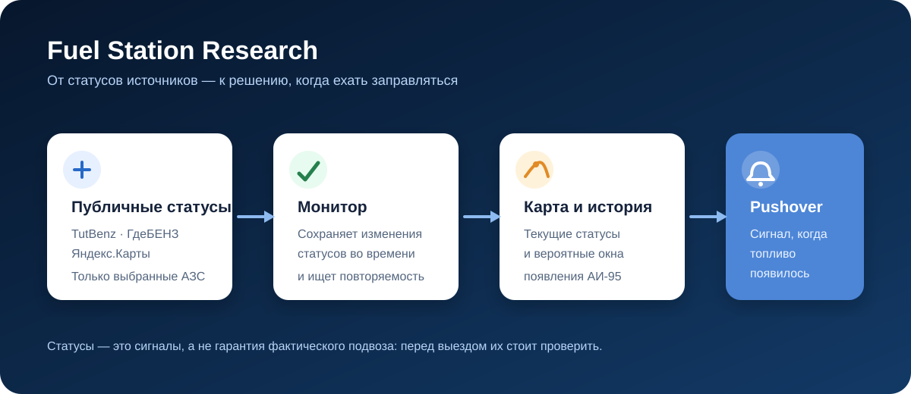
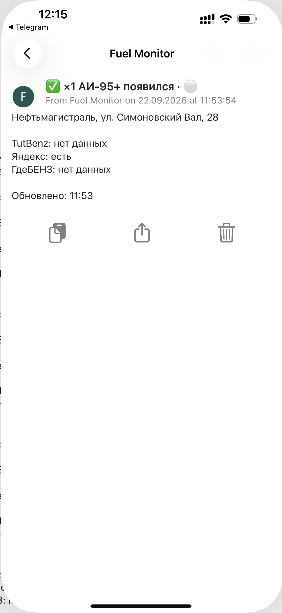
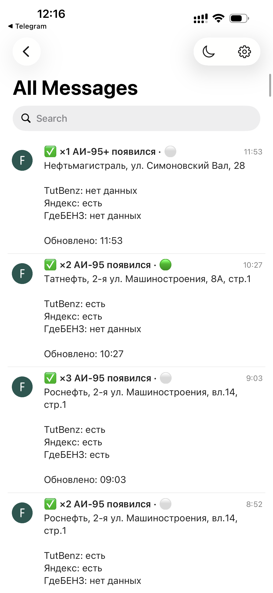

# Fuel Station Research

Открытый монитор наличия АИ‑95 на выбранных АЗС.

Он собирает публичные статусы из TutBenz, ГдеБЕНЗ и Яндекс.Карт, ведёт журнал изменений, может отправлять уведомления через Pushover при появлении топлива и включает карту с хронологией статусов в браузере.



## Уведомления в действии

<p>
  
  
</p>

Слева — подробная карточка: АЗС, время обновления и статусы TutBenz, Яндекса и ГдеБЕНЗ. Справа — лента нескольких срабатываний за день: она помогает быстро выбрать, куда ехать.

## Что опубликовано

В репозитории есть реальные отслеживаемые АЗС, публичные идентификаторы источников, вся накопленная история событий и снимок карты проекта. Журнал содержит статусы с временными метками; по нему можно анализировать повторяющиеся окна появления топлива.

В репозитории нет учётных данных Pushover, LAN-адресов, сведений об SSH, путей к ключам, компонентов умного дома, состояния запущенных процессов, логов и приватных резервных копий.

## Быстрый старт

1. При необходимости добавьте учётные данные Pushover в локальное окружение:

   ```sh
   export PUSHOVER_TOKEN='...'
   export PUSHOVER_USER_KEY='...'
   ```

2. Запустите разовую проверку:

   ```sh
   python3 check_ai95.py
   ```

3. Запускайте монитор только если готовы оставить локальный процесс работающим постоянно:

   ```sh
   ./fuel-monitor.sh start
   ```

## Карта и история уведомлений

Откройте [`dashboard/ai95-map.html`](dashboard/ai95-map.html), чтобы увидеть карту, и [`dashboard/notification-history.html`](dashboard/notification-history.html), чтобы увидеть хронологию изменений статусов, которые могли привести к уведомлению. Страница загружает [`data/events.jsonl`](data/events.jsonl), поэтому локально репозиторий нужно открыть через HTTP:

```sh
python3 -m http.server 8047
```

## Ограничения

Переход `unknown → available` может означать повторную синхронизацию источника, а не фактический подвоз. Считайте изменение статуса сигналом к проверке перед выездом, а не гарантией физического наличия топлива.

## License

MIT
